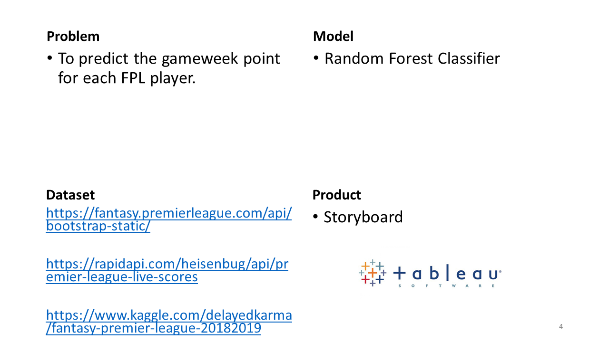

# Project Capstone

## Episode I

## Episode II

 

### Fitbit Datasets

I obtained my Fitbit Data from Zenodo.org. The datasets were generated by 35 respondents to a survey (via Amazon Mechanical Turk) from 12th March to 12th May 2016.

The raw datasets contain the following information:

- Steps, Distance, Calories and Active Minutes by Day
- Steps, Calories and Intensity Levels by Hour
- Steps, Calories, Active Minutes and Sleep Data by Minute
- Heart Rate by Second
- Weight and BMI Data

 

I worked on the 1st month of the datasets (instead of 2 months) to assess if the datasets were suitable for developing a prediction model.

Firstly, I performed data cleaning e.g. imputed participators' height using weight and BMI. Next, I merged the raw datasets (which were separated initially) by creating the following output files:

- activity.csv
- hours.csv
- minutes.csv
- seconds.csv
- weight.csv

 

### FitRec Datasets

I decided to obtain another dataset from the FitRec Project.. find out why in Episode 3! The  datasets contains 253,020 workouts from 1,104 Endomondo users.

The raw dataset was stored as a single 6-gigabyte json file and hence I had to split the massive file into smaller json files. 

Each workout contained detailed information e.g. gender, sport, location, altitude, timestamp, heart-rate and speed. However, there were missing information in the datasets e.g. no speed data for 80% of the workouts.

The smaller json files contains missing or additional data:

| Attribute | Unit | Type | Description |
| --- | --- | --- | --- |
| Speed | km/h | Missing | Calculated using derived Distance and Time Difference |
| Distance | m | Additional | Derived from Latitude and Longitude using Haversine formula |
| Time Difference | sec | Additional | Time Difference between consecutive Timestamps |

 

Next, I created summary tables e.g. endomondoHR_proper_dist_spd_time_summary.csv. 

Each row represents a workout:

| Type | Attributes |
| --- | --- |
| Meta | Workout ID, User ID, Gender, Sport, URL |
| Time | Start, End, Duration |
| Location | Start/End Latitude/Longitude |
| Altitude | Avg/Min/Max, Different Percentiles and Difference (Max-Min) |
| Heart-Rate | Avg/Min/Max Different Percentiles and Heart-Rate Zones |
| Speed | Avg/Min/Max, Different Percentiles and Speed Zones |
| Impute | 0: Original Speed 1: Derived Speed |

 

The summary tables were used as props aka "Model Predictors" in Episode 4.

 

## Episode III

 

### Fitbit EDA

I performed preliminary analysis and created several charts for the datasets. Some charts include:

- BMI Scatterplot (Weight vs Height)
- Activity Level (e.g. High, Sedentary) Distribution by participators
- Steps Count by Day (for 1 participator in a Week)

I concluded that the datasets were not suitable for to build a model predictor. Some reasons were:

Missing Data:
- Some participators only had 1 week of data for the 1st month.
- Only 11 out of 35 participators had Weight data.
- Only 50% of participators had Heart-Rate data.

Use-Case:
- It will be difficult to classify Participator Id due to missing data.
- Needed a better use-case with more practical application.
- The datasets were more appropriate for individual fitness review than building a classification model.

Links: [2_eda_fitbit](code/fitbit/2_eda_fitbit.ipynb)

 

### FitRec EDA

Firstly, I created charts of selected individual workouts e.g. workout route with altitude, speed over time. I realised the timestamps had varying intervals and performed additional data cleansing (i.e. created a time difference column for each json). In addition, I created a lineplot to compare heart-rates for 2 different workouts e.g. cycling and running. I realised I could create a prediction model to classication workout types using features like heart-rate zones.

I created boxplots by grouping workout types for Time, Altitude, Heart-Rate and Speed data. I discovered workouts with abnormal data:

- Workouts which are over 24 hours.
- Negative and high altitudes (higher than Mount Everest)
- Negative and low heart-rates (i.e. below resting heart-rate of 40 BPM).
- Speed which broke each sport's world record.

I removed these outliers during the modelling process.

I created scatterplots e.g. Heart-Rate vs Speed by Sports. I could use heart-rates (either using aggregated values or zones) and speed (aggregate values) as features to develop the classification model.

<i>More Updates on Tableau Dashbboard</i>

Links: [2_eda_fitrec](code/fitrec/2_eda_fitrec.ipynb) | [2_eda_fitrec_2](code/fitrec/2_eda_fitrec_2.ipynb) | [tableau](https://public.tableau.com/profile/cheekeet#!/vizhome/2_eda_fitrec_2/Sports)

 

## Episode IV

Watch here for more updates.

Links: [3_model_fitrec](code/fitrec/3_model_fitrec.ipynb)

 

## Episode V

Watch the last episode: [Link](documents/part-05/part-05%(final).pptx)

 

## Credits

[1] Furberg, R., Brinton, J., Keating, M., & Ortiz, A. (2016). Crowd-sourced Fitbit datasets 03.12.2016-05.12.2016 [Data set]. Zenodo. http://doi.org/10.5281/zenodo.53894

[2] Jianmo Ni, Larry Muhlstein, Julian McAuley, "Modeling heart rate and activity data for personalized fitness recommendation", in Proc. of the 2019 World Wide Web Conference (WWW'19), San Francisco, US, May. 2019. https://sites.google.com/eng.ucsd.edu/fitrec-project/home

[3] Fitbit Inc, "How do I track my heart rate with my Fitbit device?", Aug. 2019. https://help.fitbit.com/articles/en_US/Help_article/1565
