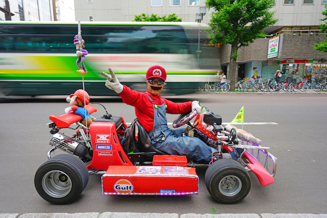

# Project Capstone

## Episode II

 

### Fitbit Datasets

I obtained my Fitbit Data from Zenodo.org. The datasets were generated by 35 respondents to a survey (via Amazon Mechanical Turk) from 12th March to 12th May 2016.

The raw datasets contain the following information:

- Steps, Distance, Calories and Active Minutes by Day
- Steps, Calories and Intensity Levels by Hour
- Steps, Calories, Active Minutes and Sleep Data by Minute
- Heart Rate by Second
- Weight and BMI Data

 

I worked on the 1st month of the datasets (instead of 2 months) to assess if the datasets were suitable for developing a prediction model.

Firstly, I performed data cleaning e.g. imputed participators' height using weight and BMI. Next, I merged the raw datasets (which were separated initially) by creating the following output files:

- activity.csv
- hours.csv
- minutes.csv
- seconds.csv
- weight.csv

 

### FitRec Datasets

I decided to obtain another dataset from the FitRec Project.. find out why in Episode 3! The  datasets contains 253,020 workouts from 1,104 Endomondo users.

The raw dataset was stored as a single 6-gigabyte json file and hence I had to split the massive file into smaller json files. 

Each workout contained detailed information e.g. gender, sport, location, altitude, timestamp, heart-rate and speed. However, there were missing information in the datasets e.g. no speed data for 80% of the workouts.

The smaller json files contains missing or additional data:

| Attribute | Unit | Type | Description |
| --- | --- | --- | --- |
| Speed | km/h | Missing | Calculated using derived Distance and Time Difference |
| Distance | m | Additional | Derived from Latitude and Longitude using Haversine formula |
| Time Difference | sec | Additional | Time Difference between consecutive Timestamps |

 

Next, I created summary tables e.g. endomondoHR_proper_dist_spd_time_summary.csv. 

Each row represents a workout:

| Type | Attributes |
| --- | --- |
| Meta | Workout ID, User ID, Gender, Sport, URL |
| Time | Start, End, Duration |
| Location | Start/End Latitude/Longit,ude |
| Altitude | Avg/Min/Max, Different Percentiles and Difference (Max-Min) |
| Heart-Rate | Avg/Min/Max Different Percentiles and Heart-Rate Zones |
| Speed | Avg/Min/MaxDifferent,  Percentiles and Speed Zones |
| Impute | 0: Original Speed 1: Derived Speed |

 

The summary tables were used as props aka "Model Predictors" in Episode 4.

 

## Episode III

<b>Important Announcement</b>

- We found Mario's Kart and the cartridge in 79 Anson Road.
- [Click here to watch the video](part-03.md)

 

<i>Wed Message Log:</i>

<i>GA Student: Who has stolen Episode 3?</i>

<i>Slackbot: I heard rumours that Mario has hidden the video cartridge in his Kart.. he is racing in the inaugural GA X Mario Kart Tournament this Friday.</i>

 

[<<< Rewind to Episode I](../README.md)
